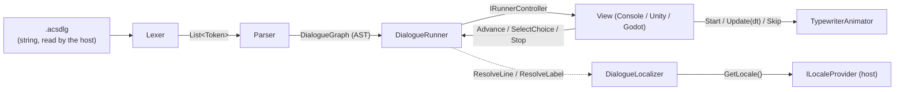
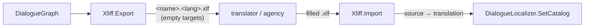
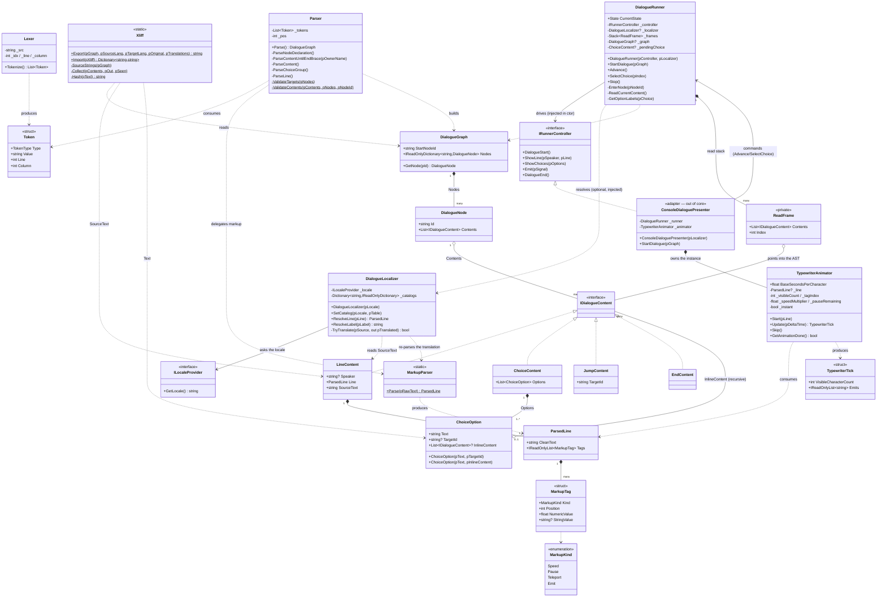

# ACSDlg — C# Core UML

*Class diagram of the core, state: architecture v0.3 (inline choices + localization).*
*Renders on GitHub and in VS Code (Markdown preview). Update it together with the code.*

## Overview (pipeline)



## Localization pipeline (offline, host-driven)



## Class diagram



## Relation legend

| Arrow | Meaning |
|---|---|
| `*--` (composition, filled diamond) | owns and manages the lifecycle (the graph owns its nodes) |
| `o--` (aggregation, empty diamond) | references without owning (a ReadFrame points into the AST, does not own it) |
| `<|..` (realization, dashed) | implements the interface |
| `..>` (dependency, dashed) | uses / produces / consumes, without holding |
| `-->` (association) | holds a durable reference |

## The four lines of force to remember

1. **The one-way pipeline**: `string → Lexer → Parser → DialogueGraph → DialogueRunner → IRunnerController`. Nothing flows back up; the View answers only through the runner's public commands (`Advance`, `SelectChoice`, `Stop`).
2. **The engine boundary passes through three points only**: the interface `IRunnerController` (the runner drives the View without knowing it), the `ILocaleProvider` interface (the core learns the active locale without knowing the engine), and the `TypewriterAnimator` (core class, but its *instance* is owned and pulsed by each View with its own deltaTime). Everything else in the core is invisible to the engine.
3. **The Model recursion drives the runtime recursion**: `ChoiceOption.InlineContent` loops back to `IDialogueContent` (a block can contain choices); runner-side, that recursion is walked with the `ReadFrame` stack (push on entering a block, pop = Ink-style fall-through, clear on jump).
4. **Localization is optional and source-keyed**: the runner resolves through a `DialogueLocalizer` only when one is injected (`null` = source language, zero overhead). The lookup key is the raw `SourceText`; a translated line is re-parsed once by `MarkupParser`; the XLIFF `id` is an opaque tool handle, never the key.

## Invariant reminders (details in ACSDlg_Architecture_v0.3.md)

- The core references no engine, no file, no clock. The netstandard BCL (incl. `System.Xml.Linq`, used by `Xliff`) is allowed.
- Content types are pure data; behaviour lives in the runner (flow) and the View (rendering).
- `ChoiceOption`: exactly one of `TargetId` / `InlineContent` is set (guaranteed by the two constructors + the parser).
- Markup is parsed once at AST construction for the source language; a translated line is re-parsed once on resolution.
- Parse-time validation: jump/choice targets (recursive inside blocks), `#start`, duplicate nodes, unknown tags — `FormatException` with line/column.
- Translation identity is the source text (gettext model); empty XLIFF targets fall back to the source line at runtime.
```
