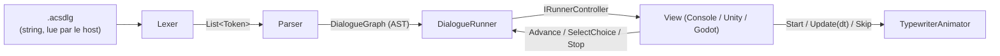
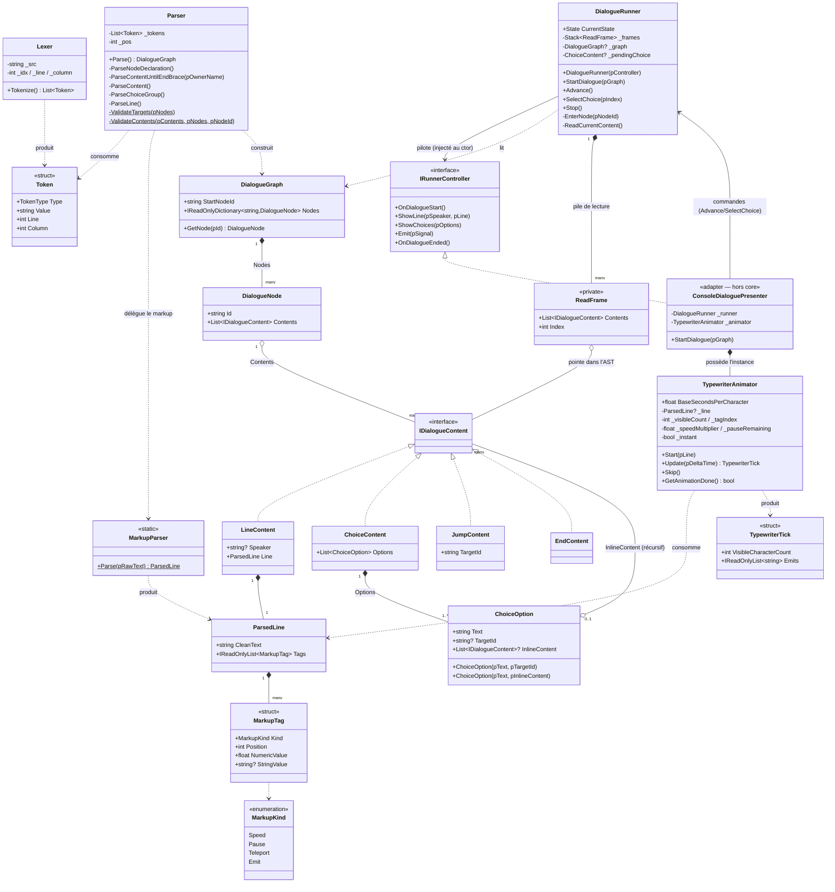

# ACSDlg — UML du Core C#

*Diagramme de classes du core (`Core/src/`), état : architecture v0.2 + choix inline.*
*Se rend sur GitHub et dans VS Code (aperçu Markdown). Mettre à jour en même temps que le code.*

## Vue d'ensemble (pipeline)

## Diagramme de classes

## Légende des relations

| Flèche | Sens |
|---|---|
| `*--` (composition, losange plein) | possède et gère le cycle de vie (le graphe possède ses nodes) |
| `o--` (agrégation, losange vide) | référence sans posséder (une ReadFrame pointe dans l'AST, ne le possède pas) |
| `<|..` (réalisation, pointillés) | implémente l'interface |
| `..>` (dépendance, pointillés) | utilise / produit / consomme, sans détenir |
| `-->` (association) | tient une référence durable |

## Les trois lignes de force à retenir

1. **Le sens unique du pipeline** : `string → Lexer → Parser → DialogueGraph → DialogueRunner → IRunnerController`. Rien ne remonte ; la View répond uniquement par les commandes publiques du runner (`Advance`, `SelectChoice`, `Stop`).
2. **La frontière moteur passe par deux points seulement** : l'interface `IRunnerController` (le runner pilote la View sans la connaître) et le `TypewriterAnimator` (classe core, mais *instance* possédée et pulsée par chaque View avec son propre deltaTime). Tout le reste du core est invisible au moteur.
3. **La récursion du Model fait la récursion du runtime** : `ChoiceOption.InlineContent` boucle vers `IDialogueContent` (un bloc peut contenir des choix) ; côté runner, cette récursion se parcourt avec la pile de `ReadFrame` (push à l'entrée d'un bloc, pop = retombée à la Ink, clear sur jump).

## Rappels d'invariants (détail dans ACSDlg_Architecture_v0.2.md)

- Le core ne référence aucun moteur, aucun fichier, aucune horloge.
- Les types de contenu sont des données pures ; le comportement vit dans le runner (flux) et la View (rendu).
- `ChoiceOption` : exactement un de `TargetId` / `InlineContent` est renseigné (garanti par les deux constructeurs + le parser).
- Le markup est parsé une fois, à la construction de l'AST.
- Validation au parsing : cibles de jump/choice (récursif dans les blocs), `#start`, doublons de nodes, balises inconnues — `FormatException` avec ligne/colonne.
